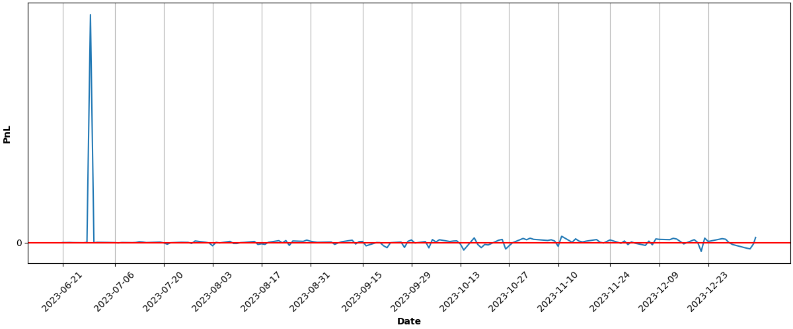

  

Dollar Cost Averaging with Leveraged/Inverse Funds
==================================================


**⛔ WARNING: This project is purely for experimental purposes and is not investment advise. If you decide to try it, RUN IT ON PAPER ACCOUNT ONLY!⛔**


---


Introduction
------------


 The goal of this experiment is to buy leveraged/inverse funds in regular intervals. For this experiment I will be buying `SVIX` and `FNGU` for about $10 each per day. This is a very risky strategy and using real money is not recommended.
   

 I could not find a broker that supports automatic recurring investments in leveraged funds or one that has an api and supports fractional shares. Most brokers like Robinhood and Webull that support recurring investments do not support recurring investments in leveraged or inverse funds. Large brokers that do have APIs like Tradestation and IKBR do not allow fractional shares. M1 Finance does not support `SVIX` and `FNGU`. Alpaca is the only broker that I found that supports fractional shares (not for `SVIX` at the time of writing) but they don't let you deposit money in the account in regular intervals. For this experiment I will stick with Alpaca because I don't have a better option. 
 * `SVIX` - 1x VIX Short Term Futures ETN - 1 share every Tuesday and Thursday since they don't support fractional shares.
* `FNGU` - 3x FANG+ ETN - $10 worth everyday


---


Testing
-------


 To run the scipt, you would need to install dependencies by running the following command:
 
```
pip install -r requirements.txt
```

 You would need the following environment variables:
 * `ALPACA_ENDPOINT` set to `https://paper-api.alpaca.markets`
* `ALPACA_KEY_ID`
* `ALPACA_SECRET`

 To buy an asset, you would need to run the following command like:
 
```
python main.py --symbols FNGU=\$10 SVIX=1
```

The `--symbols` argument takes an array of key-value pairs where the key is the asset's symbol and value is the number of shares to buy or notional value in dollars (prefixed with $)


---


Results
-------


| Asset | Average Price | Current Price | ROI | 📈 |
| --- | --- | --- | --- | --- |
| FNGU | $174.982347912 | $158.49 | -9.43% | &#128308;&#128546; |
| SVIX | $28.218672222 | $24.83 | -12.01% | &#128308;&#128546; |
| **Total** |  |  | **-10.81%** | &#128308;&#128557; |

### PnL over time (calculations may not be accurate):





---


Updated at 2023-10-19 15:04:57


